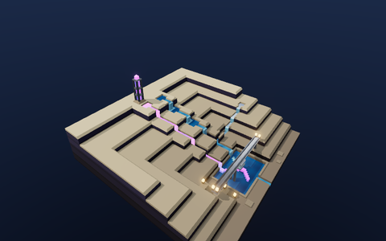
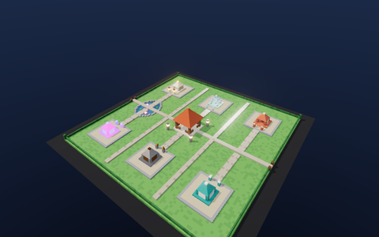
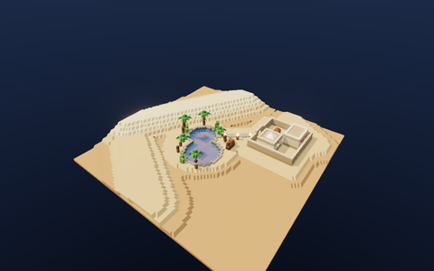

# buildingblock

Voxel building sandbox in the browser. **[Try it](https://chh-ay.github.io/buildingblock/)**


Place, erase and paint blocks — cubes, slabs, ramps, thin wall panels, and corner wedges for proper roof hips. Press **R** to rotate anything directional (or pick an exact facing in the panel), **F** to focus whatever you're pointing at, drag out rectangles, undo freely. Every edit gets journaled, so you can hit Replay and watch your build reassemble itself brick by brick. When you like what you made, copy a build link — the whole world is gzipped into the URL itself, nothing gets uploaded anywhere. There's also a live mode: a Share link puts you and your friends in the same world over WebRTC, no server involved, with named cursors showing who's holding which tool where.

The Gallery has nine scenes to start from:

| | | |
|:---:|:---:|:---:|
|  |  |  |
|  |  |  |
|  |  |  |

Shape Garden walks every block shape in every material; Plasma Falls is the shader demo — animated plasma and water running through one canyon.

Other bits: a day/night cycle synced to your clock, autosave you can tune or turn off in Settings (30s–5m intervals), named saves, `.bbk.gz` world files, MagicaVoxel `.vox` import *and* export, `.glb` export, and tiny synthesized click sounds (no audio files, it's all oscillators).

## Custom materials

Materials are pluggable. A block material is just a name, an opacity flag, and a three.js TSL node material — register one and it shows up as a paintable class in the color panel, meshed into its own draw bucket:

```ts
import { registerBlockMaterial } from "./render/custom";

registerBlockMaterial(
  {
    name: "Lava",
    opaque: true,
    makeMaterial: () => {
      const m = new MeshStandardNodeMaterial();
      m.emissiveNode = /* any TSL node graph — see plasmaMaterialDef */;
      return m;
    },
  },
  { chunks, scheduler, state },
);
```

The three that ship — Plasma (animated glow), Metal (PBR), Water (animated translucency) — are ~20 lines each in [`src/render/custom.ts`](src/render/custom.ts) and double as worked examples. One caveat: class ids are baked into saved worlds in registration order, so always append, never reorder.

## Running it

```sh
bun install
bun run dev
```

`bun test`, `bun run check` (tsc) and `bun run lint` (biome) are the gates. `bun run gallery` rebuilds the bundled scenes from `scripts/gallery/scenes/` — a scene is ~100 lines of `ctx.set`/`ctx.box` calls against a tiny builder API, so adding your own is a quick afternoon thing.

## How it's built

Rendering is three.js WebGPU with TSL node materials, falling back to WebGL2 where WebGPU isn't available. Chunks are 32³ with palette-compressed storage; meshing is a binary greedy mesher (bitmask set algebra, baked ambient occlusion) that does a terrain chunk in about half a millisecond and runs in a worker pool, with a synchronous path so single-block edits never feel laggy. Shapes are pure mesher template data — all 19 block shapes share one culling/emission path. Shadows only re-render when something changes. The whole UI is vanilla DOM on top of a ~25-line signal store.

Layout, roughly: `src/core` is the world and pure logic, `src/mesh` the mesher, `src/render` everything three.js touches, `src/interact` tools and input, `src/net` the P2P room, `src/io` codecs and saves, `src/ui` panels and menus, `src/app` the feature modules main.ts wires together. The perf HUD lives in Settings if you want to watch the numbers.

Desktop and tablet only.
