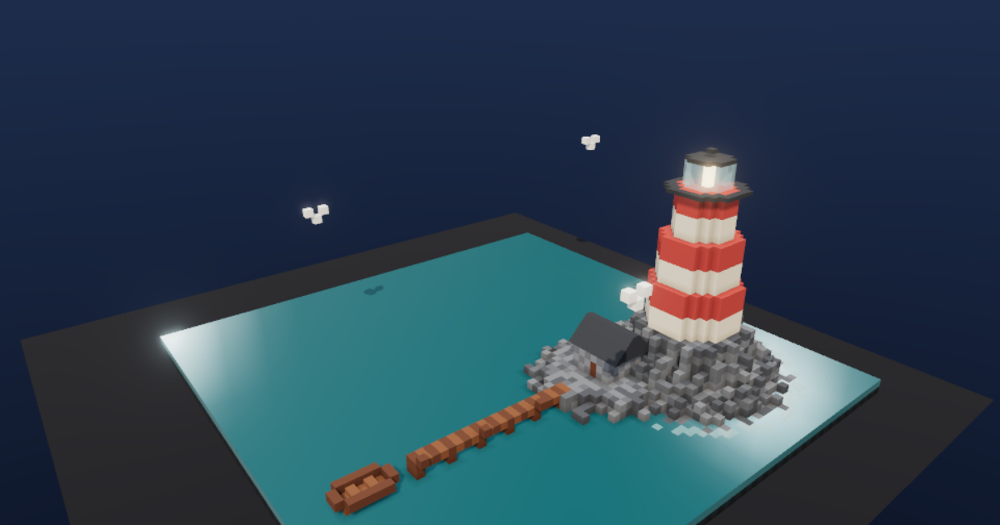
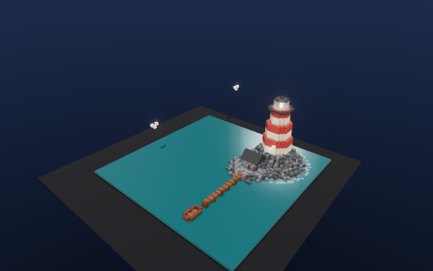
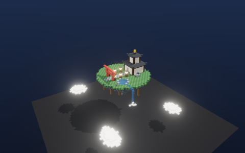
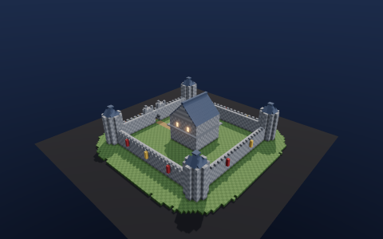
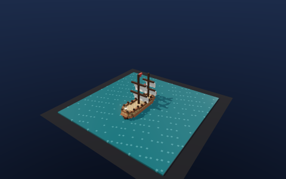
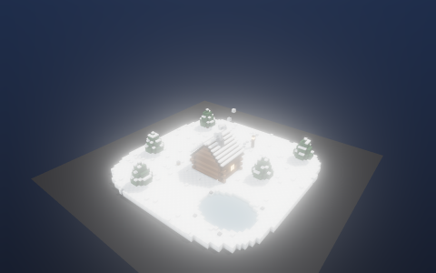
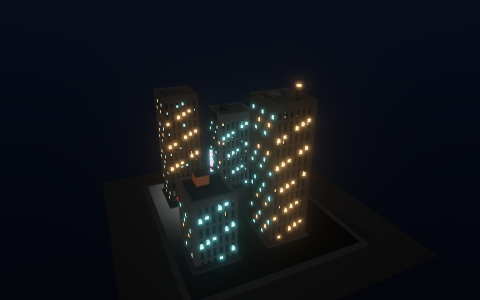

# buildingblock

A fast voxel building sandbox that runs entirely in your browser. WebGPU-first rendering, real-time collaboration with zero servers, and worlds you can share as a single link.

**Build something → [chh-ay.github.io/buildingblock](https://chh-ay.github.io/buildingblock/)**



## What it does

- **Place, erase, paint** — instant feedback on pointer-down, drag for rectangles, mouse-wheel box heights. Cubes, slabs, and ramps that auto-face away from the camera.
- **Replay your build** — every edit is journaled; watch the whole thing reassemble brick-by-brick under an orbiting camera.
- **Share as a link** — the entire world rides gzipped inside the URL fragment. No accounts, no uploads; whoever opens it can remix immediately.
- **Build together** — zero-host P2P rooms over WebRTC (nostr signaling). Live peer cursors with derived names and colors, snapshot sync for late joiners.
- **Gallery** — six curated dioramas, one click to load and remix:

| | | |
|:---:|:---:|:---:|
|  |  |  |
| Harbor Lighthouse | Sky Temple | Castle Keep |
|  |  |  |
| Sail Ship | Winter Cabin | Neon Alley |

- **Day/night cycle** that follows your clock (or manual sun control), bloom, PCF shadows rendered on demand.
- **Persistence** — IndexedDB autosave, named saves, `.bbk.gz` world files, MagicaVoxel `.vox` import/export, `.glb` mesh export, PNG screenshots.
- Procedural sound effects and particle bursts, synthesized at runtime — zero audio assets.

## Performance

The renderer is WebGPU (`three/webgpu` + TSL node materials) with an automatic WebGL2 fallback. Geometry comes from a **binary greedy mesher**: bitmask set algebra over 32³ chunks with baked 3-neighbor ambient occlusion — roughly 0.02 ms per empty chunk, 0.55 ms per terrain chunk on a laptop core, scheduled across a worker pool with a synchronous fast path for single-block edits. Palette-compressed chunk storage (u8 → u16 spill), 11-byte network edit records, 2-u32 journal entries.

`Settings → Perf HUD` shows fps, frame times, draw calls, triangles, remesh latency, and the active backend.

## Development

```sh
bun install
bun run dev        # vite dev server
bun run check      # tsc --noEmit
bun run lint       # biome
bun test           # bun:test suites
bun run build      # production bundle
bun run gallery    # rebuild public/gallery from scripts/gallery/scenes
```

Deployed to GitHub Pages by `.github/workflows/deploy.yml` on every push to `main` (lint → typecheck → test → build → deploy).

## Architecture notes

- `src/core` — chunked voxel world, interned block states, DDA raycast, edit journal. Pure logic, no rendering.
- `src/mesh` — greedy mesher + worker scheduler. The mesher is the hot path; everything is typed arrays.
- `src/render` — three.js WebGPU renderer, TSL materials, environment, highlights, particles. three.js never leaks outside this directory (plus the glTF exporter).
- `src/interact` — tools as pure gesture state machines; the input router owns the DOM.
- `src/net` — trystero room wiring, peer identity derivation, 12-byte cursor records.
- `src/io` — BBK binary codec, saves, share links, vox/glTF interchange.
- `src/ui` — vanilla DOM + a 27-line signal store. No framework.

Desktop and tablet only — it wants a pointer and a real GPU.
